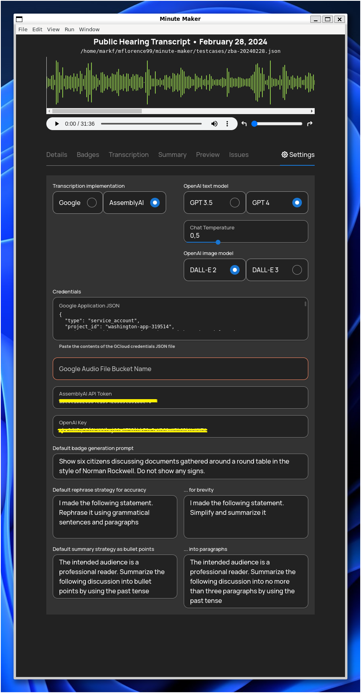

# MinuteMaker

The MinuteMaker app provides transcription capabilities for formal meetings. [AssemblyAI](www.assemblyai.com) speech-to-text is used to transcribe an MP3 recording of the meeting and [OpenAI](www.openai.com) is used to enhance utterances into grammatical sentences and paragraphs, and to automatically generate a summary of the meeting.

MinuteMaker is not engineered for environments (like a court of law, where participants are under oath) where the exact words spoken must be memorialized. Rather, it fits into the narrower space in which the sense and intent of the meeting is paramount. We use it to generate minutes for various land use boards.

## Getting Started

On the first use, key settings must be supplied. MinuteMaker has built-in defaults for many of them, although the AssemblyAI, Google and OpenAI credentials are per user. 

## Beginning Work

Once these settings are made, an MP3 recording of the meeting can be opened to start a new transcription. Transcriptions are saved as self-contained JSON files and they can be reopened at any time later for further work. The original audio file is uploaded to Google Cloud Storage and incorportated by reference into the JSON. 

## Details

This tab records the meeting's metadata. 

## Badges

A badge can be generated (using DALL-E 2 or 3) to illustrate the transcript. 

## Transcription

The transcription can be edited, either by directly typing into the speaker and utterance fields, or via the context menu. 

## Summary

When transcription editing is finished, a summary can be generated, either as bullet points or as complete paragraphs. 

## Issues

The Issues tab highlights any problems with the transcription. 

## Preview

The Preview tab shows what the final document will look like. The Export button produces an HTML rendering, which can be opened in a browser and "printed" to a [PDF file](docs/transcript.pdf) for distribution. 
